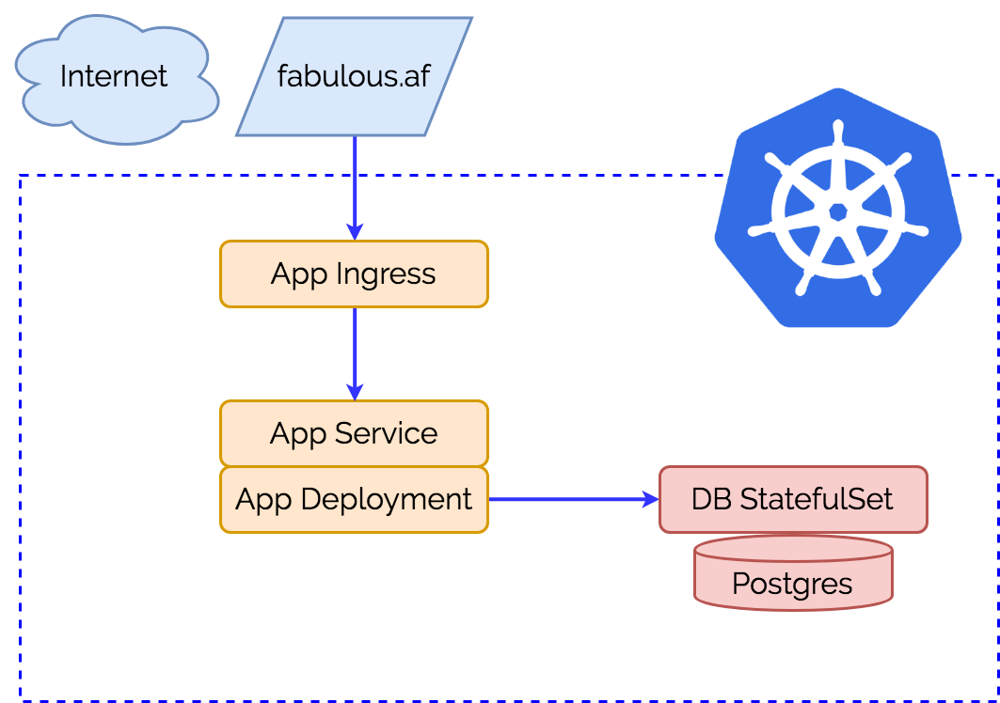

<p align="center"></p>

# Welcome to the Kris Nova Stateful Application!

### Deploying the application:

```bash
kubectl create -f manifests/
```

### Delete the application

```bash
kubectl delete -f manifests
```

### Update docker registry with a new build

```bash
make container push
```

### Get the public address

```bash
k get svc -owide | grep statefulapp-service | cut -d " " -f 16
```

### Create database in server

```bash
k exec -it $(k get po | grep postgres | cut -d " " -f 1) -- bash -c "psql -c 'CREATE DATABASE stateful_app_development;' -U postgres"
```